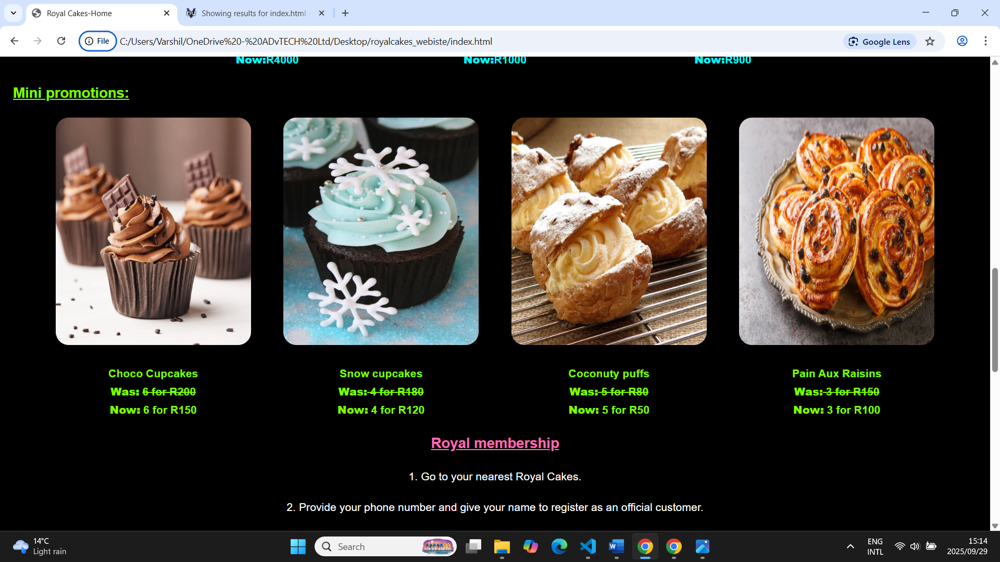
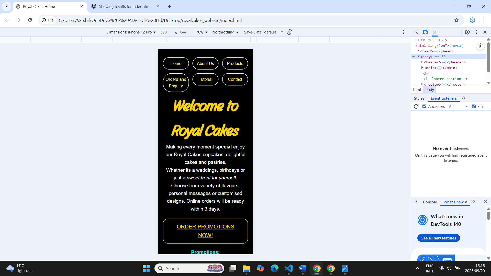

# Wede5020-part1

##Student information
-Name:Varshil Rathod
-Student number:ST10499213
-Moudle:WEDE5020

##Porject Overview 
A website for Royal Cakes that is easy and user friendly for customers.Its shows products like cakes,cupcakes and pastries and can order .It also has a tutorial page so people can follow on making their own produccts and review system.

##Website goals and objectives
	-Attract customers by showing quality images of our products and easy to read details.
	-Making online orders for pickup or delivery easy and simple for people.
 -Share promotions deals and new designs to keep customers coming.
 -Within a year bring 40% more customers after it launches.  
	-Have 40 cake orders per month at least.
	-From the website at least 20 reviews per month.

##Key features and functionality
-	Homepage: showing best sellers and mini promotion items to attract customers.
-	About page: bakery storyline, values and missions to help customers to connect to the brand.
-	Product page: Show clear pictures of products with prices to make it easy for customers.
-	Tutorial page: showing videos of fast and easy ways of baking with less time.
-	Enquiry page: Placing orders and posting review.
-	Contact page: provide address, phone numbers, emails and a review system for customs.

##Timeline and milestones
-	15-18 Aug: Planning project (ideas, goals, management).
-	19-21Aug: Collecting information (text, images, videos).
-22-27Aug: Structure HTML with organised folders and files and hand in.

  ##Part 1 details
  Completed home,about,product,enquiry,tutorial and contact pages .
  Having images,videos,contact information ,review and order system and menu.

##Stiemap
Homepage(index.html)
About us(about.html)
Products(product.html)
Order and enquiry(enquiry.html)
Tutorial(tutorial.html)
Contact us(contact)

##Changelog

-Part 1
-Date:2025-08-20
 Made improvement in head banners of the webiste adding better images using Photopea.This makes the banners nicer and more beautiful.

-Date:2025-08-21
Added 9 images to the homepage in a table layout this makes the images look will organised and making the page eye catching from the start.

-Date:2025-08-24
Added an extra image of map for the second shop in the contact page so users can visually see the address and pick the nearest one .

-Date:2025-08-25
Added radio buttons and checkboxes in the enquiry page so customers could select the flavors they had and their best one ,this way we could understand them better .

-Date:2025-08-26
Added a tutorial page with 4 videos to show visitors how to baking  in less time and have good food.s
Vidoes were about baking a cupcake ,donuts ,cakes and pastry.
Added a tutorial link to the navigation bar on all pages making it easy.
Added the videos in table layout so it could look oraganised  and easy to see in html only .

-Date:2025-08-27
Added a footer to all pages making in a official no copy right allowed .
Fixed splling errors.
Added Instagram and Tiktok links so later they can get a icon when doing css and customers can visit thise pages.
Added information about Royal membership and for collecton and delivery in homepage.
Updated sitemap by adding inforamtion to each page of whats gonana be there and added a new page tutorial  and its information about the 4 videos .
Updated proposal and research.

Part 1 feedback improvement 

-Date : 2025-09 -20 

Change in proposal Design Aesthetic :

•	Colour scheme: Black background with bright colors .Gold for headings and buttons ,aqua for promotions ,lawn green for mini promotions and pink for team and cupcakes and white for text .

•	typography: Heading(h1) Story Script cursive , 4 rem desktop ,3rem tablet ,2rem phone . Saubheadings(h2-h5) Arial or Helvetica ,22px desktop ,20px tablet and mobile . Body text 23px for intro paragraphs desktop , 20px for tablet intro and 15 px for phone and the rest of the body 17px.
•	The font hierarchy makes sure for clear readability.

•	Layout and Design: Navigation: clear with hover effects improves discoverability .

Responsiveness : Media queries made sure layout ,font sizes and images across desktop ,tablet and phone . Readably and easy access:

High contrast text on dark background making it clear to see .Visual cues: hover effects on images ,buttons and the enquiry section .

Content hierarchy: large headings ,images have glow boarders and spacing to ensure easy to read texts.

User Experience: Clear images, easy navigation consistent colours for making it easy for customer. 

.Change in the Proposal: Wireframes 

.(Navigation)
Home
About Us
Products
Orders and Enquiry
Tutorial
Contact

.(Banner)
Head Banner with the comapny logo 

.(Introduction )
Welcome to Royal Cakes
Making every moment special enjoy our Royal Cakes cupcakes, delightful cakes and pastries.
Whether its a weddings, birthdays or just a sweet treat for yourself.
Choose from variety of flavours, personal messages or customised designs. Online orders will be ready within 3 days.

.(Call to action )
ORDER PROMOTIONS NOW!

Promotions:
image 1
iamge 2
iamhe 3 

.(Royal membership)
1.Go to your nearest Royal Cakes.

2.Provide your phone number and give your name to register as an official customer.

3.After buying 15 items you will become a Royal Customer.

4.So after being a Royal Customer get 15% promotion from R200 and above.

#Research 
Pick up and deliver.
Collection
Collection takes place at the nearest Royal Cakes.
Come with your order number or phone number to confirm your order.
Collection can take place during bakery hours.
Delivery
Order will be delivered to your door. For delivery a additional price is added depending on the length of traveling. You can also use Mr D
About us 
Our Values
•	Quality: Quality always comes first at Royal Cakes. Best ingredients are always picked. Satisfying our customer fully by baking with care and following high standards while making cakes, cupcakes and pastries.
•	Creativity: All our products have meanings. Having skilled team members with talents and passion creating tasty and fresh products. This makes every bite at events memorable and enjoyable.
•	Care: Every step of baking is made with love. From mixing to decorating. Royal cakes have kind and friendly service. To make every customer feel special we pay close attention to their requirements.
Orders an enquiry
Please select which famous flavours you have consumed:
Chocolate, Vanilla  and Strawberry
Please select your best flavour :
Chocolate,Vanilla,Red velvet,Carrot,Lemon,Strawberry,Coffee,Caramel and Oreo
Contact
Join the Royal family and follow us on:
 Instagram
 TikTok 

-Date :2025-09-21

Updated the Part 1 commits by adding more detail of the html changes like improvement to the  banners ,images layout ,tutorial page ,Instagram and TikTok page links and the footers.

#Homepage screenshots

##Desktop
.hp laptop 1366px , 768px

##Mobile 
.Iphone 12 pro

.Sumsung s20 ultra

##Tablet
.Ipad Air

.Surface pro 7

-Part 2 

#css styling for desktop 

##External Stylesheet 

.Created an external css file called style.css.
-Linked the css file to the home, about us, products, orders and enquiry ,tutorial and contact html pages.

#Base style 

-Css reset: is used and uses margin:0; padding:0; box-sizing: border-box .This makes sure all elements start the same way in every brewers .Removing extra spacing and keeping layouts consistent .

-body: element uses black background with white text ,Arial or Helvetica as a default font ,Font size of 1.0625rem and a line-height of 1.6 for comfortable reading and padding of 20px .

-color scheme and theme: a dark background black with bright colors for headings like gold, aqua, lawn green ,pink and orange .The colors are also used for buttons ,hover effects ,image cards and giving good visually .

-Media Queries : breakpoints applied are (768px-1023px) for tablets and (max-width:768px) layouts changed form multiply columns grinds to one or two column grids . Images ,navigation ,videos and font change as the screen changes .

-Navigation : Flexbox is used for horizontal menu .Buttons have white borders ,round corners and gold hover effect .

-Forms: the inputs and textareas have bottom borders and focus effects for better usability .

-Mission ,vision and team sections have coloured boarders ,padding and round images  with captions matching there border colors .

#Typography style 

-Font: Arial .Helvetica ,sans-serif and  Story Script ,cursive .

-Line-height 1.6 adds extra space between the text and makes paragraph much easier to read preventing the text to look crowed .

-Main heading h1 Font size 4rem was used very large and bold so the website title can catch attention , Sub headings h2,h3,h4,h5 font size is 22px keeping them large enough to be seen important as h1.h1 's paragraph is 1.4375rem its a little bigger than the normal body text making it easy to introduce the main points . 

##changelog

-Date:2025-09-23

. The HTML pages these were changes made :

Added class and div elements to better orgaonse the content and and make styling easier.

Removed the u element because underling the text looked unprofessional with the font .

Removed the remaining table ,tr and td elements for the images so that the flexbox could be used makin it easy to maintain .

Added a link for a font call Story Script so the main headings could look stylish and different .

Changed order promtion now! call to action to capital letters.

-Date:2025-09-24 

Navigation was uneven were in squares so i changed it to flexbox added round buttons making it neat and in the middle .

The head banner was to simple so added a gold glow to the border and a animation popin to have a great entrance for the website .

Added css comments for the homepage and about page  as i was done with it .

-Date:2025-09-25
In the production page there were 4 pastry images add so it could be equal to the cupcake images .

The pictures were set but were lacking attraction so added hover effect to the homepage images and glow boarder effect for the product images .

Captions of the images were pure white making the website less colorful so change those captions with the images border colors . 

-Date:2025-09-26
Downloaded and added icon for Instagram and TikTok link page for the Royal Cakes .Giving both a orange hover colour .

Decided to give the tutorial videos a hover due to it being a simple page . 

-Date:2025-09-27 
Changed head banner width and height to max-width: 100% height: auto;  width: 100%; had them fixed at  height of 350px and width of 1525px  .
Added a introduction paragraph for the contact page  .

-PART 3

-Accordions

These are sections on a page that can open or close when you click on them. Each heading can be clicked to show or hide the content below it. Using JavaScript or jQuery, accordions keep the page neat and make it easier for users to read only the information they want .This is at the end of the tutorial page having tips for equipments .

-Lightbox Modal

So in the index page the first 7 images and in the product page all images  by clicking on the images opens them in a full screen model .The JS dynamically updates the models to match the clicked images and add glow effects .

-Interactive Maps

In the contact page there are two maps .
Interactive zoom users can  zoom in and out the + and - or mouse scroll .
Move around clicks and drag the map to check other areas.
Fullscreen option here user can expand the map to Fullscreen for better view .
live map features user can interact with real map elements like places ,directions and labels .

-Animations and Transitions

Banner animation every banner images uses popin keyframe animation to scale in and fade in smoothly .
Navigation hover effects so the navigations glow when we hover or click it .
Images hover effect so the images in the index page hover when and when we click the images in index and products the full scale with a glow effect .

-Advanced DOM Manipulation

Form Validation dynamically check inputs in the order and review forms. For invalid fields error messages are displayed or alerts are triggered and preventing submission until the user corrects the input.
Search Functionality the search input filters all product sections (wedcake,custome cake ,cupcake and pastries) by comparing the figcaption text with the search query. Sections without matches are hidden, and a “No results found” message is dynamically shown or hidden.

-Gallery with Lightbox

Clicking on an image opens a lightbox overlay (#lightbox) with a larger view of the image.
The glow around the lightbox image is determined by the image’s data-glow attribute (e.g., aqua, lawngreen), creating a visually engaging effect.
Users can close the lightbox via the .close button, making navigation intuitive.

-Search Functionality to Filter Content

Users can type keywords in the search input.
JavaScript iterates over each section and each product’s figcaption.
Products that match the search query remain visible; non-matching products are hidden.
Sections without any visible products are hidden entirely along with their heading.
If no products match, a “No results found” message is dynamically displayed within the main content area.
This functionality provides realtime filtering, improves usability, and makes it easy for users to quickly find specific products. It’s a practical example of combining DOM manipulation with user input to enhance the interactivity of a website.

-Keyword Research

The website uses important words and phrases that people might search for when looking for your bakery, like “Royal Cakes,” “Bakery Johannesburg,” or “Cake orders.” These words are added naturally in headings, paragraphs, and website tags so search engines can find your site. Using city or neighborhood names (like “Johannesburg” or “Blairgowrie”) helps people nearby find your bakery more easily.

-Title Tags and Meta Descriptions

Each page in your project includes descriptive title tags and meta descriptions:
Example from contact page:
<title>Contact Royal Cakes - Bakery Address, Phone & Social Media</title>
<meta name="description" content="Get in touch with Royal Cakes! Find our addresses in Blairgowrie and Mayfair, phone numbers, email, and follow us on Instagram and TikTok. Our team is ready to help with your cake orders.">
Title tags are represtive, include main keywords, and accurately describe the page.
Meta descriptions are informative, encourage clicks, and include relevant keywords without stuffing.

-Header Tags

pages are well structured with heading tags for content hierarchy:
<h1 class="main-title">Contact Information</h1> → Page-level title
<h2 class="detail">Address</h2> → Section headings
<h3 class="detail">Operating hours</h3> → Subsections
<h4 id="map">Map locations</h4> → Nested headings
This structure improves readability and SEO by signaling content importance to search engines.

-Image Optimisation Every image has good file names and have descriptive alt .

-URL Structure

There are simple and well structed making it easy understand .
ndex.html → Home
contact.html → Contact
products.html → Products
tutorial.html → Tutorial
enqiury.html → Enquiry and order 
about.html → about us 

-Internal Linking

Navigation links provide strong internal linking
nav>
    <ul>
        <li><a href="index.html">Home</a></li>
        <li><a href="about.html">About Us</a></li>
        <li><a href="products.html">Products</a></li>
        <li><a href="enquiry.html">Orders and Enquiry</a></li>
        <li><a href="tutorial.html">Tutorial</a></li>
        <li><a href="contact.html">Contact</a></li>
    </ul>
</nav>
Users can navigate easily between pages, which distributes link equity and improves SEO.

-Mobile-Friendliness

CSS includes responsive design using media queries:
Flexible grids for products, promotions, and video sections.
Adjusted navigation and banner for tablets and mobile devices.
Scalable images and lightbox for small screens.

-Social Media 

There are 2 link at the end of the contact page which are tiktok and instagram .

-Local SEO

contact page includes multiple location-based signals:
Street addresses for Blairgowrie and Mayfair.
Embedded Google Maps.
Phone numbers and email.
This helps search engines understand your business location, improving visibility for local searches like “bakery near me in Johannesburg”

-Form Elements

The enquiry and contact Both forms use appropriate input types for different data text fields for names, email fields for email addresses, password fields for secure input, and textareas for longer messages. Labels are used correctly for each input and making sure the forms are accessible and easy to understand. Required fields ensure that essential information is collected before submission.

-Form Validation

Validation is used both through HTML5 attributes and JavaScript. Required fields prevent empty submissions, and input types like email and tel ensure proper formatting.
JavaScript adds extra checks for:
Valid email format.
Password length (minimum characters).
Phone number length and numeric format.
Order scetion and revew scetion check.

-Form Submission

So in the enquiry page the submit buttons for both order and review sections the information is added to the file .
In the contact the message section the submit button with take you to a form of email application .

-Error Handling 

If anything is not filled in the enqiury page a pop up meeage will appear telling you what needs to be filled in .Also telling the reuquirment.

##changelog

-Date :2025.11.15

Removed the action attribute from the order-form and review-form. This allows JavaScript to handle form validation and submission dynamically and giving better control over error handling and user feedback before the form is sent.

-Date: 2025.11.16

Added a contact form to the contact page. The form includes fields for Username, Email, Password, and Message, with HTML5 validation rules for required inputs, minimum lengths, and proper formats. This allows users to submit messages to ROYAL CAKES easily and ensures that input is valid before submission.

Took out  the click to enlarge functionality for the DrD image and the Royal Member card on the index page. This was done because enabling full-size view caused a bug, and removing the feature ensured the page functions correctly without errors.

-Date : 2025.11.16

Updated the contact or location section by replacing static images with interactive Google Maps iframes. Added two maps showing Blairgowrie and Mayfair locations. Users can now zoom, pan, and explore the locations directly on the page, improving navigation and user engagement.

-Date : 2025.11.17

Added a tutorial section titled “Baking Equipment Tips” on the tutorial page. Implemented interactive accordion elements for each piece of equipment (Measuring Cups, Mixing Bowl, Rolling Pin, Whisk) so users can click to reveal tips. Each panel includes an image and a list of practical tips, helping users learn proper usage of baking tools.

##Referances part 3

Google Maps ,(n.d). Google Platform Documentation .[online]Available at: < https://developers.google.com/maps/documentation  > [Accessed 16 November 2025]

Makro ,2025. Stainless Stee; Mixing Bowl  .[online]Available at: < https://www.makro.co.za/generic-396831-stainless-steel-mixing-bowl/p/itm25a8efdefd011?pid=BWLH7HQYPUG7GYGH > [Accessed 16 November 2025].

MDN Web Docs ,2024.Forms .[online ]Available at: < https://developer.mozilla.org/en-US/docs/Learn/Forms > [Accessed 16 November 2025].

NPM , 2025 . Accordion JS .[online] Available at: < https://www.npmjs.com/package/accordion-js > [Accessed 16 November 2025].

W3schools.2025. JS Tutorial .[online] Available at:< https://www.w3schools.com/ > [Accessed 14,15,16 September 2025].

##Referances Part 2 

Google Fonts ,2025.Story Script ,cursive,[online] Avilable at:< https://fonts.google.com/specimen/Agila >[ Accessed 23 September 2025].

Font Awsome,2025 . Icons for Instagram and Tiktok .[online] Available at : <https://fontawesome.com/> [Accessed 26 September 2025].

McKenney,S.2025. Sally's Baking Addiction .[online] Available at : < https://sallysbakingaddiction.com/caramel-apple-turnovers/ > [Accessed 25 September 2025].

Floxo,2025.A Delightful Dance of Layers and Flavors.[online] Available at : <https://floxo.store/the-mille-feuille-a-delightful-dance-of-layers-and-flavors/ > [Accessed 25 September 2025].

W3schools.2025. Css Tutorial .[online] Available at:< https://www.w3schools.com/ > [Accessed 27,28,29 September 2025]

##Referances part 1

The wedding cake store,2019. :4 layers vanilla and blueberry wedding cake. [electronic print]. Available at:< https://www.weddingcakestoreli.com/wcs-flavors-and-fillings.php > [Accessed 22 August 2025].

Stnish,2025. Spider man double layer cake [image online]. Available at:< https://www.cakecentral.com/gallery/i/3109476/cake-by-trisha-stnish > [Accessed 22 August 2025].

@ Kitchen Creations Recipes, 2025. Easy heaven chocolate cake. [Facebook]. March 11. Available at: < https://www.facebook.com/61556768371111/posts/easy-chocolate-heaven-cakewhat-you-needfor-the-chocolate-cake2-cups-flour2-cups-/122218364558225612/ >[Accessed 22 July 2021].

Grasekamp, 2024.Chocolate cupcakes. [electronic print]. Available at: < https://bonnibakery.com/chocolate-cupcakes-with-silky-chocolate-buttercream/   > [Accessed 22 August 2025].

Da vine foods,2025. Coconut Lilikoi Puff Pastries. [electronic print]. Available at: <  https://davinehawaii.com    > [Accessed 22 August 2025].

